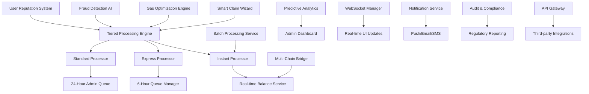

# Enhanced Professional RZC Claim System Design

## Overview

The Enhanced Professional RZC Claim System transforms the traditional token claiming experience into an intelligent, user-centric platform that adapts to individual needs and market conditions. The system implements a sophisticated tiered processing approach that balances security, user experience, and operational efficiency through smart automation and predictive analytics.

The design introduces three distinct processing tiers (Instant, Express, Standard) based on claim amounts, implements intelligent batch processing for gas optimization, and provides advanced fraud prevention with adaptive security measures. The system prioritizes user experience while maintaining robust security and compliance standards.

## Architecture

### Enhanced System Components



### Tiered Processing Architecture

1. **Instant Tier (< $50 USD)**:
   - Immediate processing with lightweight validation
   - Real-time balance updates
   - Minimal security checks for established users

2. **Express Tier ($50-$500 USD)**:
   - 6-hour pending with automated approval
   - Enhanced fraud detection
   - Batch processing optimization

3. **Standard Tier (> $500 USD)**:
   - 24-hour pending with admin review
   - Comprehensive security validation
   - Manual approval workflow

### Smart Processing Flow

1. **Claim Initiation**: Enhanced wizard with intelligent recommendations
2. **Tier Determination**: Automatic classification based on amount and user reputation
3. **Gas Optimization**: Real-time gas price analysis and batch suggestions
4. **Fraud Analysis**: AI-powered risk assessment and pattern detection
5. **Processing Execution**: Tier-appropriate processing with fallback mechanisms
6. **Completion**: Multi-channel notifications and balance updates

## Components and Interfaces

### Database Schema Extensions

#### Enhanced Claim Requests Table
```sql
CREATE TABLE claim_requests (
    id BIGSERIAL PRIMARY KEY,
    user_id BIGINT REFERENCES users(id) ON DELETE CASCADE,
    tracking_id VARCHAR(20) UNIQUE NOT NULL,
    amount NUMERIC(18,8) NOT NULL,
    usd_value NUMERIC(10,2) NOT NULL, -- USD value at time of claim
    processing_tier VARCHAR(20) NOT NULL, -- 'INSTANT', 'EXPRESS', 'STANDARD'
    status VARCHAR(20) DEFAULT 'PENDING',
    submitted_at TIMESTAMP WITH TIME ZONE DEFAULT CURRENT_TIMESTAMP,
    processing_date TIMESTAMP WITH TIME ZONE,
    processed_at TIMESTAMP WITH TIME ZONE,
    failure_reason TEXT,
    retry_count INTEGER DEFAULT 0,
    gas_price_gwei NUMERIC(10,2), -- Gas price at time of processing
    batch_id VARCHAR(50), -- For batch processing
    risk_score NUMERIC(3,2), -- AI-calculated risk score (0.00-1.00)
    user_reputation_score INTEGER, -- User reputation at time of claim
    created_at TIMESTAMP WITH TIME ZONE DEFAULT CURRENT_TIMESTAMP,
    updated_at TIMESTAMP WITH TIME ZONE DEFAULT CURRENT_TIMESTAMP
);

CREATE INDEX idx_claim_requests_user_id ON claim_requests(user_id);
CREATE INDEX idx_claim_requests_status ON claim_requests(status);
CREATE INDEX idx_claim_requests_processing_tier ON claim_requests(processing_tier);
CREATE INDEX idx_claim_requests_processing_date ON claim_requests(processing_date);
CREATE INDEX idx_claim_requests_batch_id ON claim_requests(batch_id);
CREATE INDEX idx_claim_requests_risk_score ON claim_requests(risk_score);
```

#### User Reputation System Table
```sql
CREATE TABLE user_reputation (
    user_id BIGINT PRIMARY KEY REFERENCES users(id) ON DELETE CASCADE,
    reputation_score INTEGER DEFAULT 100, -- 0-1000 scale
    total_claims INTEGER DEFAULT 0,
    successful_claims INTEGER DEFAULT 0,
    failed_claims INTEGER DEFAULT 0,
    average_claim_size NUMERIC(18,8) DEFAULT 0,
    account_age_days INTEGER DEFAULT 0,
    last_suspicious_activity TIMESTAMP WITH TIME ZONE,
    instant_claim_limit_usd NUMERIC(10,2) DEFAULT 50.00,
    express_claim_limit_usd NUMERIC(10,2) DEFAULT 500.00,
    created_at TIMESTAMP WITH TIME ZONE DEFAULT CURRENT_TIMESTAMP,
    updated_at TIMESTAMP WITH TIME ZONE DEFAULT CURRENT_TIMESTAMP
);
```

#### Gas Optimization Table
```sql
CREATE TABLE gas_optimization_data (
    id BIGSERIAL PRIMARY KEY,
    timestamp TIMESTAMP WITH TIME ZONE DEFAULT CURRENT_TIMESTAMP,
    gas_price_gwei NUMERIC(10,2) NOT NULL,
    network_congestion VARCHAR(20), -- 'LOW', 'MEDIUM', 'HIGH'
    recommended_action VARCHAR(50), -- 'PROCESS_NOW', 'WAIT', 'BATCH'
    batch_savings_percentage NUMERIC(5,2),
    created_at TIMESTAMP WITH TIME ZONE DEFAULT CURRENT_TIMESTAMP
);
```

#### Batch Processing Table
```sql
CREATE TABLE batch_processing (
    batch_id VARCHAR(50) PRIMARY KEY,
    scheduled_date TIMESTAMP WITH TIME ZONE NOT NULL,
    status VARCHAR(20) DEFAULT 'SCHEDULED', -- 'SCHEDULED', 'PROCESSING', 'COMPLETED', 'FAILED'
    total_claims INTEGER DEFAULT 0,
    total_amount NUMERIC(18,8) DEFAULT 0,
    estimated_gas_savings NUMERIC(10,2),
    actual_gas_used NUMERIC(18,0),
    created_at TIMESTAMP WITH TIME ZONE DEFAULT CURRENT_TIMESTAMP,
    processed_at TIMESTAMP WITH TIME ZONE
);
```

#### Claim Status History Table
```sql
CREATE TABLE claim_status_history (
    id BIGSERIAL PRIMARY KEY,
    claim_request_id BIGINT REFERENCES claim_requests(id) ON DELETE CASCADE,
    old_status VARCHAR(20),
    new_status VARCHAR(20) NOT NULL,
    reason TEXT,
    changed_by VARCHAR(50), -- 'SYSTEM' or admin user ID
    changed_at TIMESTAMP WITH TIME ZONE DEFAULT CURRENT_TIMESTAMP
);

CREATE INDEX idx_claim_status_history_claim_id ON claim_status_history(claim_request_id);
```

#### Enhanced Activities Table
```sql
-- Add new activity types for claim system
ALTER TABLE activities ADD COLUMN IF NOT EXISTS claim_request_id BIGINT REFERENCES claim_requests(id);
CREATE INDEX IF NOT EXISTS idx_activities_claim_request_id ON activities(claim_request_id);
```

### API Interfaces

#### Enhanced Claim Request API
```typescript
interface EnhancedClaimRequestAPI {
  // Submit new claim request with intelligent recommendations
  submitClaimRequest(userId: number, amount: number, options?: ClaimOptions): Promise<EnhancedClaimResponse>;
  
  // Get intelligent claim recommendations
  getClaimRecommendations(userId: number): Promise<ClaimRecommendations>;
  
  // Get user's claim requests with advanced filtering
  getUserClaimRequests(userId: number, filters?: AdvancedClaimFilters): Promise<EnhancedClaimRequest[]>;
  
  // Get real-time gas optimization data
  getGasOptimizationData(): Promise<GasOptimizationData>;
  
  // Batch processing operations
  scheduleBatchClaim(userId: number, amounts: number[]): Promise<BatchClaimResponse>;
  getBatchStatus(batchId: string): Promise<BatchStatus>;
  
  // User reputation and limits
  getUserReputation(userId: number): Promise<UserReputation>;
  updateUserPreferences(userId: number, preferences: UserPreferences): Promise<boolean>;
}

interface EnhancedClaimRequest {
  id: number;
  trackingId: string;
  amount: number;
  usdValue: number;
  processingTier: 'INSTANT' | 'EXPRESS' | 'STANDARD';
  status: 'PENDING' | 'PROCESSING' | 'COMPLETED' | 'FAILED' | 'CANCELLED' | 'BATCHED';
  submittedAt: string;
  processingDate?: string;
  processedAt?: string;
  timeRemaining?: number;
  failureReason?: string;
  gasPriceGwei?: number;
  batchId?: string;
  riskScore: number;
  estimatedGasCost?: number;
}

interface ClaimRecommendations {
  optimalAmount: number;
  processingTier: string;
  estimatedProcessingTime: number;
  gasCostEstimate: number;
  batchSavingsAvailable: boolean;
  batchSavingsPercentage?: number;
  nextBatchDate?: string;
  riskAssessment: string;
  alternativeOptions: AlternativeClaimOption[];
}

interface GasOptimizationData {
  currentGasPriceGwei: number;
  networkCongestion: 'LOW' | 'MEDIUM' | 'HIGH';
  recommendedAction: 'PROCESS_NOW' | 'WAIT' | 'BATCH';
  estimatedOptimalTime?: string;
  batchSavingsPercentage: number;
  historicalGasTrends: GasTrendData[];
}

interface UserReputation {
  userId: number;
  reputationScore: number; // 0-1000
  totalClaims: number;
  successRate: number;
  averageClaimSize: number;
  accountAgeDays: number;
  instantClaimLimitUsd: number;
  expressClaimLimitUsd: number;
  achievements: Achievement[];
  nextReputationMilestone?: ReputationMilestone;
}
```

#### Real-time Updates Interface
```typescript
interface ClaimWebSocketEvents {
  // Subscribe to claim updates for user
  subscribeToClaimUpdates(userId: number): void;
  
  // Claim status changed
  onClaimStatusUpdate(callback: (update: ClaimStatusUpdate) => void): void;
  
  // Processing time updates
  onProcessingTimeUpdate(callback: (update: TimeUpdate) => void): void;
  
  // System notifications
  onSystemNotification(callback: (notification: SystemNotification) => void): void;
}

interface ClaimStatusUpdate {
  trackingId: string;
  oldStatus: string;
  newStatus: string;
  timestamp: string;
  timeRemaining?: number;
}
```

### Enhanced Claim Wizard Component

#### Multi-Step Wizard Interface
```typescript
interface ClaimWizardProps {
  userId: number;
  liquidBalance: number;
  onClaimSubmitted: (trackingId: string) => void;
  onError: (error: string) => void;
}

interface ClaimWizardState {
  step: 'amount' | 'review' | 'confirm' | 'submitted';
  claimAmount: number;
  processingDate: Date;
  trackingId?: string;
  isSubmitting: boolean;
  errors: Record<string, string>;
}
```

#### Claim Status Dashboard Component
```typescript
interface ClaimStatusDashboardProps {
  userId: number;
  refreshInterval?: number; // milliseconds
}

interface ClaimStatusState {
  activeRequests: ClaimRequest[];
  completedRequests: ClaimRequest[];
  isLoading: boolean;
  lastUpdated: Date;
}
```

## Data Models

### Core Data Structures

#### Claim Request Model
```typescript
class ClaimRequestModel {
  id: number;
  userId: number;
  trackingId: string;
  amount: number;
  status: ClaimStatus;
  submittedAt: Date;
  processingDate: Date;
  processedAt?: Date;
  failureReason?: string;
  retryCount: number;
  
  // Computed properties
  get timeRemaining(): number;
  get canBeCancelled(): boolean;
  get statusHistory(): ClaimStatusHistory[];
  
  // Methods
  updateStatus(newStatus: ClaimStatus, reason?: string): void;
  process(): Promise<ProcessingResult>;
  cancel(): Promise<boolean>;
}

enum ClaimStatus {
  PENDING = 'PENDING',
  PROCESSING = 'PROCESSING', 
  COMPLETED = 'COMPLETED',
  FAILED = 'FAILED',
  CANCELLED = 'CANCELLED'
}
```

#### Enhanced User Balance Model
```typescript
interface UserBalanceModel {
  userId: number;
  claimableRZC: number;
  claimedRZC: number;
  pendingClaimAmount: number; // Amount in pending claims
  totalEarned: number;
  lastClaimTime?: Date;
  
  // Computed properties
  get availableForClaim(): number; // claimableRZC - pendingClaimAmount
  get totalPendingClaims(): number;
  
  // Methods
  canClaim(amount: number): boolean;
  reserveForClaim(amount: number): void;
  releaseReservation(amount: number): void;
  processClaim(amount: number): void;
}
```

### Processing Queue Model
```typescript
interface ProcessingQueueModel {
  getEligibleClaims(): Promise<ClaimRequest[]>;
  processClaim(claimId: number): Promise<ProcessingResult>;
  retryFailedClaim(claimId: number): Promise<ProcessingResult>;
  getQueueStats(): Promise<QueueStats>;
}

interface ProcessingResult {
  success: boolean;
  error?: string;
  shouldRetry?: boolean;
  nextRetryAt?: Date;
}

interface QueueStats {
  totalPending: number;
  processingToday: number;
  averageProcessingTime: number;
  failureRate: number;
}
```

## Enhanced Correctness Properties

*A property is a characteristic or behavior that should hold true across all valid executions of a system—essentially, a formal statement about what the system should do. Properties serve as the bridge between human-readable specifications and machine-verifiable correctness guarantees.*

### Property Reflection

After analyzing all acceptance criteria, several properties can be consolidated to eliminate redundancy:

- Properties for tier processing (1.1, 1.2, 1.3) can be combined into a single comprehensive tiered processing property
- Properties for batch processing (2.1, 2.2, 2.3) can be consolidated into batch processing behavior property
- Properties for reputation management (3.1, 3.2, 3.5) can be combined into reputation system property
- Properties for UI recommendations (4.1, 4.2, 4.3, 4.4) can be consolidated into intelligent recommendation property
- Properties for automated processing (5.1, 5.2, 5.3) can be combined into tiered automation property

### Core Enhanced Correctness Properties

**Property 1: Tiered Processing Classification**
*For any* claim request, the system should classify it into the correct processing tier (Instant < $50, Express $50-$500, Standard > $500) based on current USD exchange rates and process according to tier-specific rules.
**Validates: Requirements 1.1, 1.2, 1.3, 1.4**

**Property 2: Batch Processing Optimization**
*For any* set of small claims under $50, the system should offer batch processing options with accurate gas savings calculations and process batched claims together on scheduled dates.
**Validates: Requirements 2.1, 2.2, 2.3, 2.4**

**Property 3: Adaptive Reputation Management**
*For any* user, the system should maintain accurate reputation scores based on claim history and adjust limits dynamically, increasing privileges for good standing users and implementing restrictions for suspicious behavior.
**Validates: Requirements 3.1, 3.2, 3.3, 3.4, 3.5**

**Property 4: Intelligent Claim Recommendations**
*For any* user session, the system should analyze current conditions (balance, gas prices, user reputation) and provide optimal claim recommendations including amount, timing, and processing method.
**Validates: Requirements 4.1, 4.2, 4.3, 4.4**

**Property 5: Tiered Automated Processing**
*For any* claim in each processing tier, the system should execute appropriate automation (instant for small claims, 6-hour auto-approval for express, admin queue for standard) with proper error handling and retry mechanisms.
**Validates: Requirements 5.1, 5.2, 5.3, 5.4, 5.5**

**Property 6: Dynamic Security Validation**
*For any* claim request, the system should apply appropriate security measures based on claim size and user reputation, performing lightweight validation for trusted users and comprehensive checks for high-risk scenarios.
**Validates: Requirements 6.1, 6.2, 6.3, 6.4, 6.5**

**Property 7: Progressive Real-time Updates**
*For any* claim status change, the system should provide immediate UI updates for instant claims, real-time progress for pending claims, and graceful degradation during connectivity issues.
**Validates: Requirements 7.1, 7.2, 7.3, 7.4, 7.5**

**Property 8: Self-Healing Error Recovery**
*For any* error condition, the system should attempt automatic recovery for transient issues, provide clear user guidance for actionable problems, and implement circuit breakers to prevent cascade failures.
**Validates: Requirements 8.1, 8.2, 8.3, 8.4, 8.5**

**Property 9: Adaptive Cross-Platform Experience**
*For any* device or connection type, the system should optimize the interface and functionality to provide the best possible experience, prioritizing appropriate features based on platform capabilities.
**Validates: Requirements 9.1, 9.2, 9.3, 9.4, 9.5**

**Property 10: Predictive Administrative Intelligence**
*For any* administrative operation, the system should provide predictive insights, automated parameter adjustment, and proactive issue prevention based on historical patterns and current system state.
**Validates: Requirements 10.1, 10.2, 10.3, 10.4, 10.5**

**Property 11: Gas Cost Optimization**
*For any* claim scenario, the system should provide accurate gas cost estimates, recommend optimal timing based on network conditions, and implement batch processing to minimize total costs.
**Validates: Requirements 11.1, 11.2, 11.3, 11.4, 11.5**

**Property 12: Enhanced Vault Management**
*For any* user's token allocation, the system should provide clear visibility into locked tokens, accurate unlock schedules, and flexible management options within security constraints.
**Validates: Requirements 12.1, 12.2, 12.3, 12.4, 12.5**

**Property 13: Gamification and Social Features**
*For any* user interaction, the system should track and reward optimal behavior, provide meaningful achievements, and display relevant community insights while maintaining privacy.
**Validates: Requirements 13.1, 13.2, 13.3, 13.4, 13.5**

**Property 14: Multi-Chain Integration**
*For any* external integration request, the system should support multiple blockchain networks, DeFi protocol connections, and third-party wallet compatibility while maintaining security standards.
**Validates: Requirements 14.1, 14.2, 14.3, 14.4, 14.5**

<function_calls>
<invoke name="prework">
<parameter name="featureName">professional-rzc-claim-system

## Error Handling

### Error Categories and Recovery Strategies

#### Validation Errors
- **Insufficient Balance**: Clear message with current balance and maximum claimable amount
- **Invalid Amount**: Specific guidance on valid range and format requirements
- **Account Status Issues**: Explanation of account requirements and resolution steps
- **Duplicate Requests**: Information about existing pending request with tracking details

#### Processing Errors
- **Database Failures**: Automatic retry with exponential backoff, balance restoration on failure
- **Network Issues**: Queue request for retry, maintain user notification of delays
- **External Service Failures**: Graceful degradation with manual processing fallback
- **Timeout Errors**: Automatic retry with extended timeout, escalation to admin if persistent

#### System Errors
- **Service Downtime**: Maintain processing queue, resume on recovery with integrity checks
- **Data Corruption**: Automatic detection and recovery from backup, admin notification
- **Configuration Issues**: Fail-safe defaults, immediate admin alerting
- **Resource Exhaustion**: Load balancing, request throttling, capacity alerts

### Error Recovery Mechanisms

#### Automatic Recovery
```typescript
interface ErrorRecoveryService {
  retryFailedClaim(claimId: number, maxRetries: number): Promise<ProcessingResult>;
  restoreBalanceOnFailure(userId: number, amount: number): Promise<boolean>;
  resumeProcessingAfterDowntime(): Promise<RecoveryStats>;
  validateDataIntegrity(): Promise<IntegrityReport>;
}
```

#### Manual Recovery Tools
- Admin dashboard for manual claim processing
- Balance adjustment tools with audit logging
- Bulk processing capabilities for system recovery
- Data integrity verification and repair tools

## Testing Strategy

### Dual Testing Approach

The system will employ both unit testing and property-based testing to ensure comprehensive coverage and correctness validation.

#### Unit Testing Focus
- **Specific Examples**: Test concrete scenarios like processing a $100 claim request
- **Edge Cases**: Test boundary conditions like minimum/maximum claim amounts
- **Error Conditions**: Test specific failure scenarios and recovery mechanisms
- **Integration Points**: Test API endpoints, database operations, and external service interactions

#### Property-Based Testing Focus
- **Universal Properties**: Test that correctness properties hold across all possible inputs
- **Comprehensive Input Coverage**: Generate random users, amounts, and timing scenarios
- **Invariant Validation**: Ensure system invariants are maintained under all conditions
- **Concurrency Testing**: Validate system behavior under concurrent claim submissions

### Property-Based Testing Configuration

Each property test will be configured to run a minimum of 100 iterations to ensure thorough coverage through randomization. Tests will be tagged with references to their corresponding design properties:

**Tag Format**: `Feature: professional-rzc-claim-system, Property {number}: {property_text}`

#### Example Property Test Structure
```typescript
// Feature: professional-rzc-claim-system, Property 1: Balance Consistency and Validation
describe('Balance Consistency Property', () => {
  it('should maintain balance integrity for all claim submissions', async () => {
    await fc.assert(fc.asyncProperty(
      fc.record({
        userId: fc.integer(1, 10000),
        claimAmount: fc.float(0.01, 1000),
        initialBalance: fc.float(0, 2000)
      }),
      async ({ userId, claimAmount, initialBalance }) => {
        // Property test implementation
        const result = await submitClaimRequest(userId, claimAmount);
        const newBalance = await getUserBalance(userId);
        
        if (claimAmount <= initialBalance) {
          expect(result.success).toBe(true);
          expect(newBalance.claimable).toBe(initialBalance - claimAmount);
        } else {
          expect(result.success).toBe(false);
          expect(newBalance.claimable).toBe(initialBalance);
        }
      }
    ), { numRuns: 100 });
  });
});
```

### Testing Framework Selection

The system will use **fast-check** for property-based testing in TypeScript, providing:
- Comprehensive random data generation
- Shrinking capabilities for minimal failing examples
- Integration with existing Jest/Vitest test suites
- Support for async property testing

### Test Coverage Requirements

- **Unit Tests**: Minimum 90% code coverage for all claim-related modules
- **Property Tests**: All 25 correctness properties must have corresponding property tests
- **Integration Tests**: End-to-end testing of complete claim workflows
- **Performance Tests**: Load testing for concurrent claim processing scenarios

The testing strategy ensures that both specific examples work correctly (unit tests) and that universal properties hold across all possible inputs (property tests), providing comprehensive validation of system correctness and reliability.