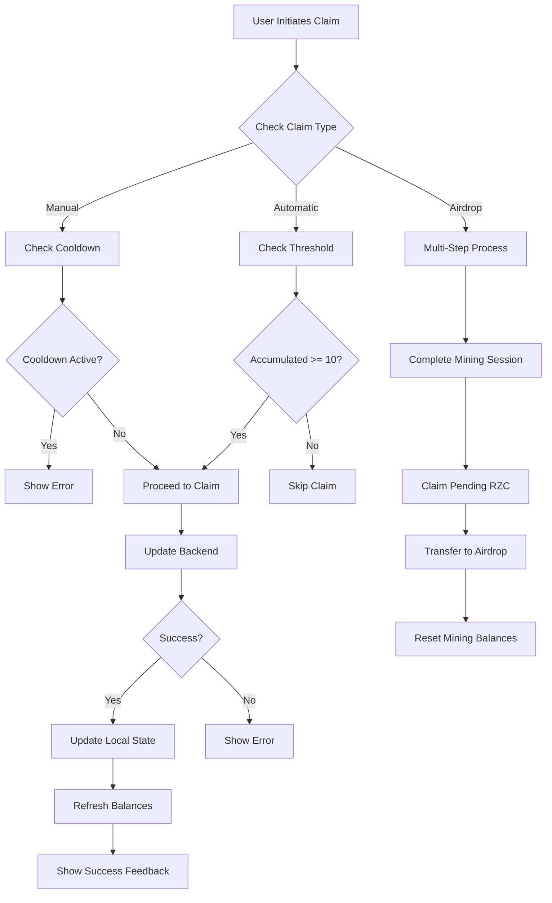

# Design Document: RZC Claiming System Analysis

## Overview

The current RZC claiming system in ArcadeMiningUI.tsx is a complex multi-layered system that handles various types of token balances and claiming mechanisms. This analysis examines the current implementation, identifies architectural strengths and weaknesses, and proposes improvements for better maintainability, user experience, and system reliability.

## Current Architecture Analysis

### Balance State Management

The system maintains four distinct balance types:
- `accumulatedRZC`: Real-time earnings during active mining (updated every second)
- `claimableRZC`: Completed mining session rewards ready for claiming
- `claimedRZC`: Previously claimed rewards in user's available balance
- `totalEarnedRZC`: Historical total of all earned RZC

**Strengths:**
- Clear separation of different balance states
- Real-time updates provide engaging user experience
- Persistent state management across sessions

**Weaknesses:**
- Complex state synchronization between frontend and backend
- Potential for race conditions during concurrent updates
- Multiple sources of truth can lead to inconsistencies

### Claiming Mechanisms

The system implements multiple claiming pathways:

1. **Automatic Threshold Claiming**: Triggers at 10 RZC accumulated
2. **Manual Claiming**: User-initiated with 30-minute cooldown
3. **Bulk Claiming**: Claims from all available sources
4. **Direct Airdrop Claiming**: Transfers all RZC to airdrop balance
5. **Season End Claiming**: Comprehensive claiming with optional airdrop requests

**Strengths:**
- Flexible claiming options for different user needs
- Automatic claiming prevents loss of progress
- Comprehensive season-end functionality

**Weaknesses:**
- Complex interaction between different claiming mechanisms
- Potential for user confusion about which claim method to use
- Error handling complexity increases with multiple pathways

## Component Architecture

### State Management Complexity

The component manages 50+ state variables, including:
- Balance states (4 types)
- UI states (loading, modals, animations)
- Mining session state
- User preferences and settings
- Cooldown and timing states

**Issues Identified:**
- Monolithic component with too many responsibilities
- State updates scattered across multiple useEffect hooks
- Difficult to test individual claiming logic
- High cognitive load for developers

### Side Effects and Timing

The component uses 15+ useEffect hooks managing:
- Real-time balance updates
- Automatic claiming logic
- State persistence
- Background synchronization
- UI animations and feedback

**Issues Identified:**
- Complex dependency arrays leading to unnecessary re-renders
- Potential memory leaks from uncleared intervals
- Race conditions between different timing mechanisms
- Difficult to debug timing-related issues

## Data Flow Analysis

### Current Claiming Flow

**Issues Identified:**
- Complex branching logic difficult to maintain
- Multiple async operations without proper error boundaries
- State updates scattered across different code paths
- Inconsistent error handling patterns

## Backend Integration Analysis

### API Calls and Data Consistency

The system makes calls to multiple backend functions:
- `claimRZCRewards(userId, amount)`: Basic claiming
- `claimTotalEarnedToAirdrop(userId)`: Airdrop transfer
- `claimAllSeasonRZC(userId)`: Season-end claiming
- `getUserRZCBalance(userId)`: Balance synchronization

**Issues Identified:**
- No transaction management for multi-step operations
- Potential for partial failures leaving inconsistent state
- Race conditions between frontend updates and backend sync
- Limited retry mechanisms for failed operations

### Balance Calculation Logic

The backend functions have complex logic for:
- Calculating total earned RZC
- Handling airdrop balance transfers
- Resetting mining activities
- Maintaining audit trails

**Issues Identified:**
- Business logic split between frontend and backend
- Inconsistent error handling across different functions
- Complex metadata management for activity tracking
- Potential for double-counting in edge cases

## User Experience Issues

### Cognitive Load

Users must understand:
- Four different balance types
- Multiple claiming mechanisms
- Cooldown periods and restrictions
- Airdrop vs mining balance differences

**Problems:**
- Overwhelming interface with too many options
- Unclear which claiming method to use when
- Confusing balance displays and calculations
- Inconsistent terminology across the interface

### Error Handling

Current error handling:
- Generic error messages
- No retry mechanisms for users
- Inconsistent feedback patterns
- Limited guidance for resolution

**Problems:**
- Users don't understand why operations fail
- No clear path to resolve issues
- Frustrating experience during network problems
- Loss of user trust due to unclear errors

## Proposed Improvements

### 1. Architectural Refactoring

**Component Decomposition:**
- Extract claiming logic into custom hooks
- Separate balance management from UI components
- Create dedicated error boundary components
- Implement proper state machines for complex flows

**Benefits:**
- Improved testability and maintainability
- Clearer separation of concerns
- Reduced cognitive load for developers
- Better error isolation and handling

### 2. Simplified User Interface

**Unified Claiming Experience:**
- Single "Claim Rewards" button with smart logic
- Automatic detection of optimal claiming strategy
- Progressive disclosure of advanced options
- Clear balance display with explanatory tooltips

**Benefits:**
- Reduced user confusion
- Improved conversion rates
- Better mobile experience
- Consistent interaction patterns

### 3. Enhanced Error Handling

**Comprehensive Error Management:**
- Specific error messages with resolution steps
- Automatic retry mechanisms for transient failures
- Graceful degradation during network issues
- User-friendly error recovery flows

**Benefits:**
- Improved user satisfaction
- Reduced support burden
- Better system reliability
- Increased user trust

### 4. Backend Transaction Management

**Atomic Operations:**
- Database transactions for multi-step claims
- Proper rollback mechanisms for failures
- Idempotent operation design
- Comprehensive audit logging

**Benefits:**
- Data consistency guarantees
- Reliable error recovery
- Better debugging capabilities
- Compliance with financial regulations

## Correctness Properties

*A property is a characteristic or behavior that should hold true across all valid executions of a system-essentially, a formal statement about what the system should do. Properties serve as the bridge between human-readable specifications and machine-verifiable correctness guarantees.*

### Property 1: Balance Conservation
*For any* claiming operation, the sum of all balance types before and after the operation should remain constant (accounting for transfers between balance types)
**Validates: Requirements 1.3, 4.5, 10.3**

### Property 2: Cooldown Enforcement
*For any* manual claim attempt, if the last claim was within 30 minutes, the system should reject the claim with appropriate messaging
**Validates: Requirements 3.2, 3.3, 3.4**

### Property 3: Threshold Claiming Consistency
*For any* mining session where accumulated RZC reaches 10 tokens, automatic claiming should trigger exactly once without duplicates
**Validates: Requirements 2.1, 2.2, 2.4**

### Property 4: Airdrop Transfer Completeness
*For any* direct airdrop claim operation, all mining balances should be reset to zero and the equivalent amount should appear in airdrop balance
**Validates: Requirements 4.5, 4.7, 9.3**

### Property 5: Error State Preservation
*For any* failed claiming operation, the system should not modify any balance states and should provide specific error feedback
**Validates: Requirements 5.1, 5.2, 5.4**

### Property 6: Balance Synchronization Accuracy
*For any* balance refresh operation, local state should match backend data within acceptable tolerance limits
**Validates: Requirements 6.1, 6.4, 10.1**

### Property 7: Multi-step Operation Atomicity
*For any* multi-step claiming process (like airdrop claiming), either all steps should complete successfully or all changes should be rolled back
**Validates: Requirements 4.2, 4.3, 4.4, 10.1**

### Property 8: Concurrent Operation Safety
*For any* concurrent claiming attempts by the same user, only one should succeed and others should be properly rejected or queued
**Validates: Requirements 6.5, 10.2, 10.3**

## Error Handling Strategy

### Categorized Error Types

1. **Validation Errors**: Insufficient balance, invalid amounts
2. **Network Errors**: Connection timeouts, server unavailable
3. **Business Logic Errors**: Cooldown violations, duplicate claims
4. **System Errors**: Database failures, unexpected exceptions

### Recovery Mechanisms

1. **Automatic Retry**: For transient network issues
2. **User Retry**: For recoverable errors with clear instructions
3. **Graceful Degradation**: Fallback to read-only mode during outages
4. **State Recovery**: Automatic synchronization after connectivity restoration

## Testing Strategy

### Unit Testing Approach
- Test individual claiming functions in isolation
- Mock backend dependencies for consistent testing
- Verify error handling for all edge cases
- Test state management logic separately from UI

### Property-Based Testing Configuration
- Use React Testing Library with custom property test utilities
- Generate random balance states and claiming scenarios
- Verify correctness properties hold across all test cases
- Test concurrent operations with race condition simulation

### Integration Testing
- Test complete claiming flows end-to-end
- Verify backend integration with real API calls
- Test error scenarios with network simulation
- Validate state persistence across browser sessions

## Implementation Recommendations

### Phase 1: Refactoring (2-3 weeks)
1. Extract claiming logic into custom hooks
2. Implement proper error boundaries
3. Add comprehensive logging and monitoring
4. Create unit tests for core functionality

### Phase 2: UX Improvements (2-3 weeks)
1. Simplify claiming interface
2. Implement better error messaging
3. Add loading states and progress indicators
4. Improve mobile responsiveness

### Phase 3: Backend Hardening (2-3 weeks)
1. Implement database transactions
2. Add retry mechanisms and circuit breakers
3. Improve error handling and logging
4. Add comprehensive monitoring and alerting

### Phase 4: Advanced Features (2-3 weeks)
1. Implement optimistic updates
2. Add offline support capabilities
3. Create advanced claiming strategies
4. Add analytics and user behavior tracking

This analysis provides a comprehensive foundation for improving the RZC claiming system while maintaining backward compatibility and user trust.