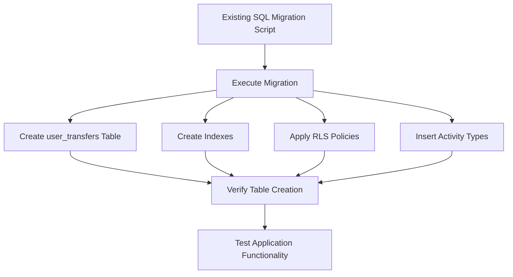

# Design Document: User Transfers Table Fix

## Overview

This design addresses the critical database issue where the `user_transfers` table is missing from the database schema, causing user-to-user RZC transfer functionality to fail. The solution involves executing the existing SQL migration script and verifying the table creation was successful.

## Architecture

The fix follows a straightforward database migration approach:



## Components and Interfaces

### Database Migration Script
- **File**: `create_user_transfers_table.sql`
- **Purpose**: Creates the complete user_transfers table schema
- **Dependencies**: Requires existing `users` and `activity_types` tables

### Table Schema
```sql
user_transfers (
    id SERIAL PRIMARY KEY,
    from_user_id INTEGER NOT NULL REFERENCES users(id) ON DELETE CASCADE,
    to_user_id INTEGER NOT NULL REFERENCES users(id) ON DELETE CASCADE,
    amount DECIMAL(20, 6) NOT NULL CHECK (amount > 0),
    status VARCHAR(20) NOT NULL DEFAULT 'pending' CHECK (status IN ('pending', 'completed', 'failed')),
    message TEXT,
    transaction_hash VARCHAR(255),
    created_at TIMESTAMP WITH TIME ZONE DEFAULT NOW(),
    updated_at TIMESTAMP WITH TIME ZONE DEFAULT NOW()
)
```

### Indexes
- `idx_user_transfers_from_user_id`: Performance for sender queries
- `idx_user_transfers_to_user_id`: Performance for recipient queries  
- `idx_user_transfers_status`: Performance for status filtering
- `idx_user_transfers_created_at`: Performance for chronological ordering
- `idx_user_transfers_user_history`: Composite index for transfer history queries

### RLS Policies
- **View Policy**: Users can view transfers they are involved in (sender or recipient)
- **Insert Policy**: Users can create transfers they are sending
- **Update Policy**: Only system functions can update transfer status

## Data Models

### UserTransfer Interface
```typescript
interface UserTransfer {
  id: number;
  from_user_id: number;
  to_user_id: number;
  amount: number;
  status: 'pending' | 'completed' | 'failed';
  message?: string;
  transaction_hash?: string;
  created_at: string;
  updated_at: string;
  from_user?: User;
  to_user?: User;
}
```

### Activity Types
- `rzc_send`: Activity type for sending RZC to another user
- `rzc_receive`: Activity type for receiving RZC from another user

## Correctness Properties

*A property is a characteristic or behavior that should hold true across all valid executions of a system-essentially, a formal statement about what the system should do. Properties serve as the bridge between human-readable specifications and machine-verifiable correctness guarantees.*

### Property 1: Complete Migration Schema Creation
*For any* database migration execution, all required table structures (columns, indexes, constraints, foreign keys) should be created successfully and be visible in the schema cache.
**Validates: Requirements 1.1, 1.2, 1.3, 1.4, 4.1, 4.2**

### Property 2: Comprehensive RLS Policy Enforcement
*For any* user operation on the user_transfers table, RLS policies should enforce that users can only view transfers they're involved in, create transfers they're sending, and prevent direct updates.
**Validates: Requirements 2.1, 2.2, 2.3, 2.4**

### Property 3: Data Constraint Enforcement
*For any* transfer record operation, all data integrity constraints should be enforced (positive amounts, valid status values, foreign key relationships, automatic timestamp updates).
**Validates: Requirements 1.2, 5.1, 5.2, 5.3, 5.4**

### Property 4: Application Functionality Restoration
*For any* application query to the user_transfers table, the operations should succeed without database errors and transfer history should load properly.
**Validates: Requirements 4.3, 4.4**

### Property 5: Activity Type Availability
*For any* transfer operation, the application should be able to log transfer activities using the required activity types ('rzc_send', 'rzc_receive').
**Validates: Requirements 3.1, 3.2, 3.3**

## Error Handling

### Migration Execution Errors
- **Table Already Exists**: Use `CREATE TABLE IF NOT EXISTS` to handle gracefully
- **Missing Dependencies**: Verify `users` and `activity_types` tables exist before migration
- **Permission Issues**: Ensure database user has CREATE TABLE privileges
- **Constraint Violations**: Handle foreign key constraint creation failures

### Verification Errors
- **Table Not Found**: Re-run migration if verification fails
- **RLS Policy Issues**: Check policy syntax and permissions
- **Index Creation Failures**: Verify column names and data types

### Application Integration Errors
- **Connection Issues**: Verify Supabase client configuration
- **Query Failures**: Check RLS policies allow expected operations
- **Data Type Mismatches**: Ensure TypeScript interfaces match database schema

## Testing Strategy

### Database Migration Testing
- **Unit Tests**: Verify each component of the migration script
- **Integration Tests**: Test complete migration execution
- **Rollback Tests**: Verify migration can be safely reversed if needed

### Application Functionality Testing
- **Connection Tests**: Verify application can connect to the new table
- **CRUD Operations**: Test create, read, update, delete operations
- **RLS Policy Tests**: Verify security policies work as expected
- **Performance Tests**: Ensure indexes provide expected query performance

### Property-Based Testing Configuration
- Use database testing framework (e.g., pgTAP for PostgreSQL)
- Minimum 100 iterations per property test
- Each property test references its design document property
- Tag format: **Feature: user-transfers-table-fix, Property {number}: {property_text}**

Both unit tests and property tests are complementary and necessary for comprehensive coverage. Unit tests verify specific migration steps and error conditions, while property tests verify universal correctness properties across all migration scenarios.